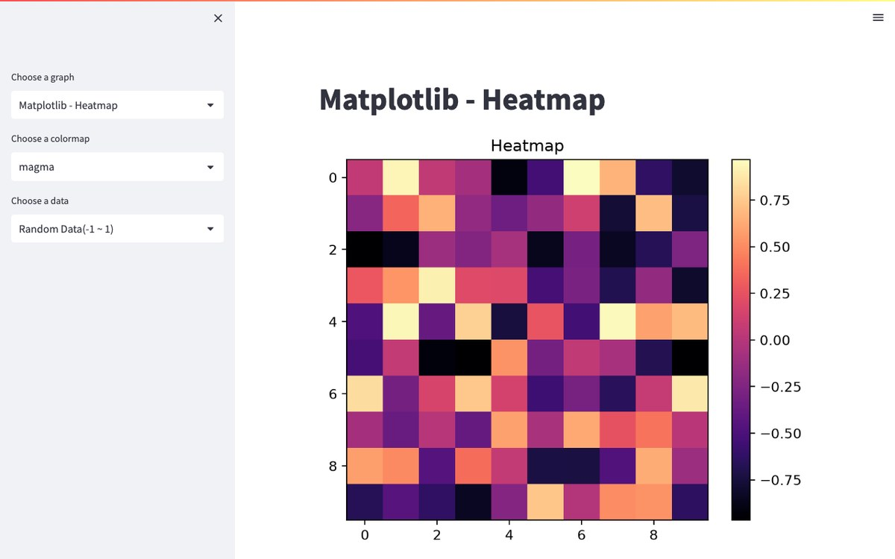

<div align="center">

# DA_School_1

**데이터분석스쿨 1기 과제: 히트맵을 그리는 다섯 가지 방법을 한 화면에서 비교하는 Streamlit 앱**




</div>

## 주요 기능

사이드바에서 세 가지를 고르면 선택한 방식으로 10×10 히트맵을 그립니다.

- **그래프 종류 (5종)**
  - Matplotlib `imshow` + colorbar
  - Seaborn `heatmap` (셀 값 주석 표시)
  - Plotly Express `px.imshow`
  - Plotly `go.Heatmap`
  - Plotly `figure_factory.create_annotated_heatmap`
- **컬러맵**: `plt.colormaps()`에 있는 전체 목록에서 선택
- **데이터 (3종)**: -1~1 균등 난수, 표준정규 난수, -100~99 정수 난수

## 실행

```bash
pip install "streamlit==1.22.0" "numpy<2" "altair<5" -r requirements.txt
streamlit run main.py
```

`main.py`는 `st.set_option('deprecation.showPyplotGlobalUse', False)`를 사용합니다. 이 옵션이 없는 최신 Streamlit(1.33, 1.64에서 확인)에서는 앱이 시작 단계에서 오류로 멈추므로, 작성 당시(2023년 4월)에 가까운 Streamlit 1.22.0으로 실행해야 합니다. 위 스크린샷도 1.22.0에서 찍었습니다.

## 기술 스택

- Python, Streamlit
- Matplotlib, Seaborn, Plotly
- NumPy

---

<div align="center">
<sub>Made by <a href="https://github.com/khwee2000">김민수 (@khwee2000)</a></sub>
</div>
